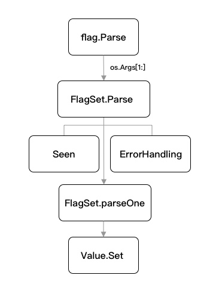

https://golang2.eddycjy.com/posts/ch1/01-simple-flag/

### 子命令的实现
首先调用了 flag.Parse 方法，将命令行解析为定义的标志，便于我们后续的参数使用。
需要处理子命令的情况，因此我们调用了 flag.NewFlagSet 方法，该方法会返回带有指定名称和错误处理属性的空命令集给我们去使用，
相当于就是创建一个新的命令集了去支持子命令

flag.NewFlagSet 方法的第二个参数是 ErrorHandling，用于指定处理异常错误的情况处理，其内置提供以下三种模式：
``` 
const (
	// 返回错误描述
	ContinueOnError ErrorHandling = iota
	// 调用 os.Exit(2) 退出程序
	ExitOnError
	// 调用 panic 语句抛出错误异常
	PanicOnError
)
```


接下来我们运行针对子命令的示例程序，对正确和异常场景进行检查，如下：
``` 
[going@dev cmd2]$ go run main.go go -name=eddycjy
2021/07/12 09:43:30 name: eddycjy
[going@dev cmd2]$ go run main.go php -n= 煎鱼
2021/07/12 09:43:40 name: 
[going@dev cmd2]$ go run main.go go -n=eddycjy
flag provided but not defined: -n
Usage of go:
  -name string
        帮助信息 (default "Go 语言")
exit status 2

```

从使用上来讲，标准库 flag 非常方便，一个简单的 CLI 应用很快就搭建起来了，但是它又是怎么实现的呢，我们一起来深入看看，要做到知其然知其所以然，肯定非常有意思，整体分析流程如下：


#### 1.4.1 flag.Parse
首先我们看到 flag.Parse 方法，它总是在所有命令行参数注册的最后进行调用，函数功能是解析并绑定命令行参数，我们一起看看其内部实现：
``` 
var CommandLine = NewFlagSet(os.Args[0], ExitOnError)
func Parse() {
	CommandLine.Parse(os.Args[1:])
}
```
该方法是调用 NewFlagSet 方法实例化一个新的空命令集，然后通过调用 os.Args 作为外部参数传入。    

但这里需要注意一个点，Parse 方法使用的是 CommandLine 变量，它所默认传入的 ErrorHandling 是 ExitOnError，
也就是如果在解析时遇到异常或错误，就会直接退出程序，
因此如果你的应用程序不希望解析命令行参数失败，就导致应用启动中断的话，需要进行额外的处理。

#### 1.4.2 FlagSet.Parse
接下来是 FlagSet.Parse，其主要承担了 parse 方法的异常分流处理，如下：

```` 
func (f *FlagSet) Parse(arguments []string) error {
	f.parsed = true
	f.args = arguments
	for {
		seen, err := f.parseOne()
		if seen {
			continue
		}
		if err == nil {
			break
		}
		switch f.errorHandling {
		case ContinueOnError:
			return err
		case ExitOnError:
			os.Exit(2)
		case PanicOnError:
			panic(err)
		}
	}
	return nil
}
````
`该方法`是对解析方法的进一步封装，实质的解析逻辑放在 parseOne 中，而解析过程中遇到的一些特殊情况，
例如：重复解析、异常处理等，均直接由该方法处理，`这实际上是一个分层明显，结构清晰的方法设计，很值得大家去参考`。

#### 1.4.3 FlagSet.parseOne
最后会流转到命令行解析的核心方法 FlagSet.parseOne 下进行处理，如下：
``` 
func (f *FlagSet) parseOne() (bool, error) {
	if len(f.args) == 0 {
		return false, nil
	}
	s := f.args[0]
	if len(s) < 2 || s[0] != '-' {
		return false, nil
	}
	numMinuses := 1
	if s[1] == '-' {
		numMinuses++
		if len(s) == 2 { // "--" terminates the flags
			f.args = f.args[1:]
			return false, nil
		}
	}
	name := s[numMinuses:]
	if len(name) == 0 || name[0] == '-' || name[0] == '=' {
		return false, f.failf("bad flag syntax: %s", s)
	}
	...
}
```
在上述代码中，我们可以看到主要是针对一些不符合命令行参数绑定规则的校验处理，大致分为以下四种情况：

- 如果命令行参数长度为 0。
- 如果遇到长度小于 2 或不满足 flag 标识符”-“。
- 如果 flag 标志位为”–“的情况下，则中断处理，并跳过该字符，也就是后续会以”-“进行处理。
- 如果在处理 flag 标志位后，取到的参数名不符合规则，也将中断处理，例如：go run main.go go ---name=eddycjy，就会导致返回 bad flag syntax 的错误提示。
 
在定位命令行参数节点上，采用的依据是根据”-“的索引定位解析出上下的参数名（name）和参数的值（value），部分核心代码如下：

``` 
func (f *FlagSet) parseOne() (bool, error) {
	f.args = f.args[1:]
	hasValue := false
	value := ""
	for i := 1; i < len(name); i++ { // equals cannot be first
		if name[i] == '=' {
			value = name[i+1:]
			hasValue = true
			name = name[0:i]
			break
		}
	}
	...
}
```

最后在设置参数值上，会对值类型进行判断，若是布尔类型，则调用定制的 boolFlag 类型进行判断和处理，
最后通过该 flag 所提供的 Value.Set 方法将参数值设置到对应的 flag 中去，核心代码如下：

``` 
func (f *FlagSet) parseOne() (bool, error) {
	if fv, ok := flag.Value.(boolFlag); ok && fv.IsBoolFlag() {
		if hasValue {
			if err := fv.Set(value); err != nil {
				return false, f.failf("invalid boolean value %q for -%s: %v", value, name, err)
			}
		} else {
			if err := fv.Set("true"); err != nil {
				return false, f.failf("invalid boolean flag %s: %v", name, err)
			}
		}
	} else {
		...
		if err := flag.Value.Set(value); err != nil {
			return false, f.failf("invalid value %q for flag -%s: %v", value, name, err)
		}
	}
}
```


### 1.5 自定义参数类型
刚刚看到上述的分析后，不知道你是否注意到，flag 的命令行参数类型是可以自定义的，也就是我们的 `Value.Set `方法，
我们只需要实现其对应的 Value 相关的两个接口就可以了，如下：
``` 
type Value interface {
	String() string
	Set(string) error
}
```

我们将原先的字符串变量 name 修改为类别别名，并为其定义符合 Value 的两个结构体方法，示例代码如下：
``` 
type Name string

func (i *Name) String() string {
	return fmt.Sprint(*i)
}

func (i *Name) Set(value string) error {
	if len(*i) > 0 {
		return errors.New("name flag already set")
	}

	*i = Name("eddycjy:" + value)
	return nil
}

func main() {
	var name Name
	flag.Var(&name, "name", "帮助信息")
	flag.Parse()

	log.Printf("name: %s", name)
}
```
该示例最终的输出结果为 name: eddycjy:Go 语言编程之旅 ，也就是只要我们实现了 Value 的 String 和 Set 方法，就可以进行定制化，
然后无缝地接入我们的命令行参数的解析中，这就是 Go 语言的接口设计魅力之处。

### 1.6 小结
我们初步介绍了本章的一个基本思路，并对我们最常用的标准库 flag 进行了介绍和使用说明，标准库 flag 的使用将始终穿插在所有的章节中，因为我们常常会需求读取外部命令行的参数，例如像是启动端口号、日志路径设置等等，非常常用。